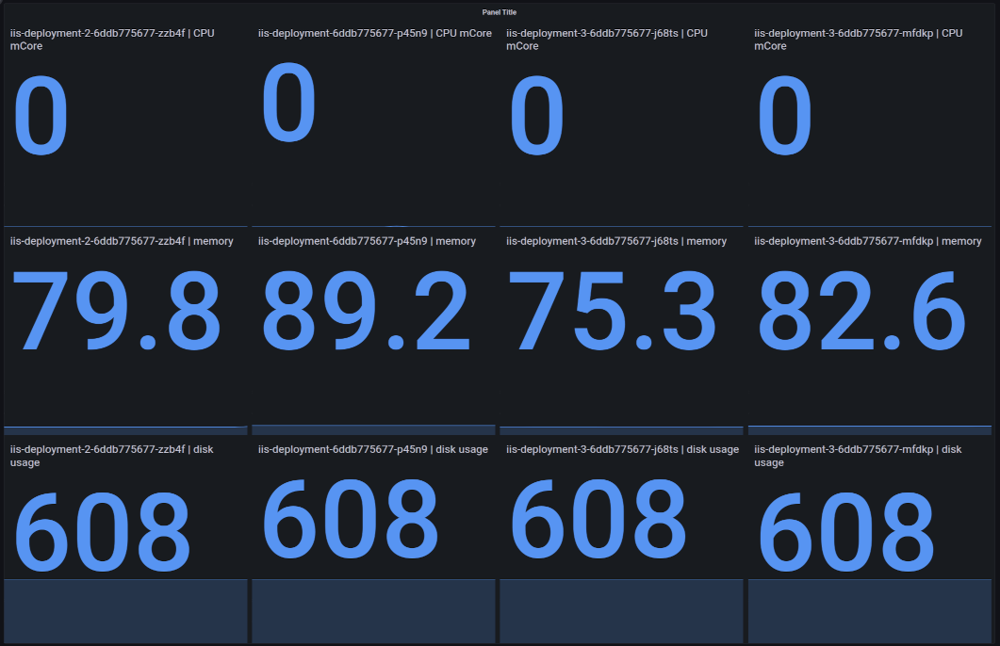

# Metrics Exporter for Windows CRI Pods

Intended to be run in a container, the exporter takes a list servers (Windows Kubernetes nodes) from each it extracts the following for each pod and exports them (to be scraped by Prometheus)

-  Pod name
-  CPU
-  Memory
-  Disk usage
-  Tx
-  Rx

<br>



<br>

## Environment Variables

---

The following env vars are required

- `USER="administrator"` (a user with crictl permissions)

- `PASSWORD="XXXXXXX"` 

- `LOG_LEVEL="DEBUG"` (DEBUG, INFO, WARN, ERROR)

- `SERVER_FILE="servers.txt"` (can be called anything, one server/windows kubernetes node per line)

<br>

## Build

---

`docker build -t windows-cri-metrics -f Dockerfile .` 

<br>

## Run

---

```

 docker run -d -p 8000:8000 --name windows-cri-metrics \
        -v $(pwd)/servers.txt:/home/metrics/servers.txt \
        -e LOG_LEVEL=DEBUG \
        -e USER="administrator" \
        -e PASSWORD="XXXXX" \
        -e SERVERS_FILE="/home/metrics/servers.txt" \
        windows-cri-metrics

```

<br>

## Metrics

---

In _Prometheus_ the metrics are called

- pod_cpu_usage_mcores
- pod_memory_usage_mb
- pod_disk_usage_mb
- pod_tx_mb
- pod_rx_mb

<br>

## Grafana

---

_If_ using _Grafana_ query for the metrics are called

- pod_cpu_usage_mcores
- pod_memory_usage_mb
- pod_disk_usage_mb
- pod_tx_mb
- pod_rx_mb

Use a custom legend e.g. __{{pod}} - CPU__ (for pod_cpu_usage_mcores) to label the query.

_This will update dynamically as pods are created and destroy._

<br>

## Limitations

---
All the nodes must have the same credentials, `PSRemoting` must be enabled and working for `WSMan`, though the exporter communicates with Windows nodes, it run on Linux


<br>

## Files

---

`windows_metrics.py` - Contacts to every Windows node, extracts pod stats, parses the metrics and exposes them for Prometheus.

`config.py` - reads the environment variables.

`metricslogger.py` - stdout logging.

`requirements.txt` - PIP requirements.

`servers.txt` - sample server list.

`Dockerfile` - build file.